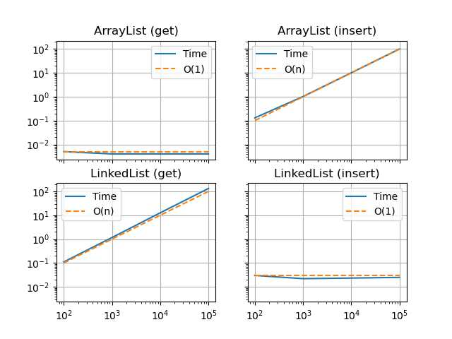

# H22_project2_mahari

- Repo url: https://github.uio.no/IN1910/H22_project0_mahari.git

## Authors
- Maha Riazi (mahari@uio.no)

# Implementing data structures
This repo contains code for ArrayList, LinkedList, LinkedArrayList and some test files. A c++ compiler is needed in order to run the code. I was able to run all the codes without any problems from my windows laptop and from a linux workstation at ifi.

# Usage
To compile all files, run
```
 make all
```
To run all files, run
```
./array_list & ./linked_list & ./linked_array_list
```
and to clean up you can run the following command:
```
 make clean
```

## Array List
You can find the code for ArrayList in array_list.cpp, tests for ArrayList can be found in test_array_list.cpp.

To compile the code for ArrayList, run
```
 make array_list 
```
in terminal. To execute the file, run
```
 ./array_list
```

## Linked List 
You can find the code for LinkedList in linked_list.cpp, the tests for LinkedList can be found in test_linked_list.cpp.

To compile the code for LinkedList, run 
```
 make linked_list
```
in terminal. To execute the file, run
``` 
 ./linked_list
```

## Linked Array List
You can find the code for LinkedArrayList in linked_array_list.cpp. The tests for linkedarraylist can be found in test_linked_array_list.cpp.

To compile the code for LinkedList, run 
```
 make linked_array_list
```
in terminal. To execute the file, run
``` 
 ./linked_array_list
```

## Algorithm analysis
Comparing the ArrayList and LinkedList in Big-O notation by looking at the cost of the following operations:

#### Get element i by index
- ArrayList: the function consists of two lines of code - one exception-check and one return. These are both primitive operations, thus the cost for arraylist's int& operator[](int index) method would be
```
    O(1)
```
- LinkedList: this method loops over every element, and for-loops are of linear time, so the cost for this method will be
```
    O(n)
```
#### Insert at front
- ArrayList: function consists of some simple primitive lines. We also have a for-loop, and an if-statment that takes us to another method containing a for loop. Inserting at front in an arraylist would mean pushing all other elements one index back, so the cost will be 
```
    O(n) + O(n) = O(2n) = O(n)
```
- LinkedList: Inserting at front in linkedlist is quite simple, and can be done with only primitive operations, so we get the cost
```
    O(1)
```
#### Insert at back (append)
- ArrayList: appending in arraylist can be primitve if we don't have to size the array, so the cost can be either 
```   
    Best case: O(1) 
    Worst case: O(n)
```
- LinkedList: inserting an element to the back in linkedlist is always primitive due to append involving only having to declare some pointers. The cost is
```
    O(1)
```
#### Insert into middle of list
- ArrayList: inserting to the middle of a list will involve having to enter loop in order to push the indices, so the cost will be
```
    O(n/2) = O(n)
```
- LinkedList: also takes a for loop in order to iterate to the right index, the cost is
```
    O(n/2) = O(n)
```
#### Remove element from front
- ArrayList: If we don't have to resize the array, then removing from front will be primitive, but if shrink_to_fit is called, we will enter a while-loop, which has the complexity of log n since the loop variables are multiplied by a constant, and the cost for this will be either
```
    Best case: O(1)
    Worst case: O(log n)
```
- LinkedList: these operations are all primitive for the linkedlist remove from front, because we're only assigning values and comparing numbers. The cost is
```
    O(1)
```
#### Remove element from back (pop)
- ArrayList: my pop function calls the remove with a specified index, so removing element from back involves having to iterate through the entire array, thus the cost will be
```
    O(n)
```
- LinkedList: every operation in the pop method in linkedlist are primitive, since all we have to do is reassign some pointers, so the cost for this function is
```
    O(1)
```
#### Remove element from middle
- ArrayList: we would have to iterate through half of the arraylist, and so the cost would be
```
    O(n/2) = O(n)
```
- LinkedList: we would have to iterate through half of the linkedlist as well, and so the cost would be
```
    O(n/2) = O(n)
```
#### Print
- ArrayList: if the array is empty, the print method is primitive, otherwise it's linear. Depending on which one, the cost is either
```
    Best case: O(1)
    Worst case: O(n)
```
- LinkedList: there is a while loop in the print function in linkedlist that will run at most n times, n being the length of the list, thus the cost will be
```
    O(n)
```

### Timing the implementations
I have timed two of the methods from ArrayList and LinkedList to compare the results with what we expect from the algorithm analysis. The codes I've used for the plots can be found in compare_array_list_and_linked_list.cpp and plotter.py.

I have timed the get methods and the insert methods of both classes, and recieved following plots:


We can see that we get the results we expected! :D
